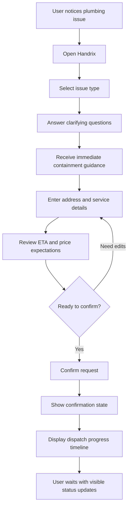
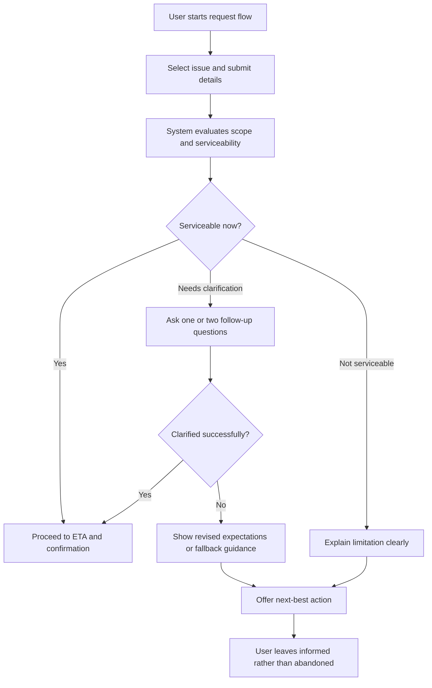
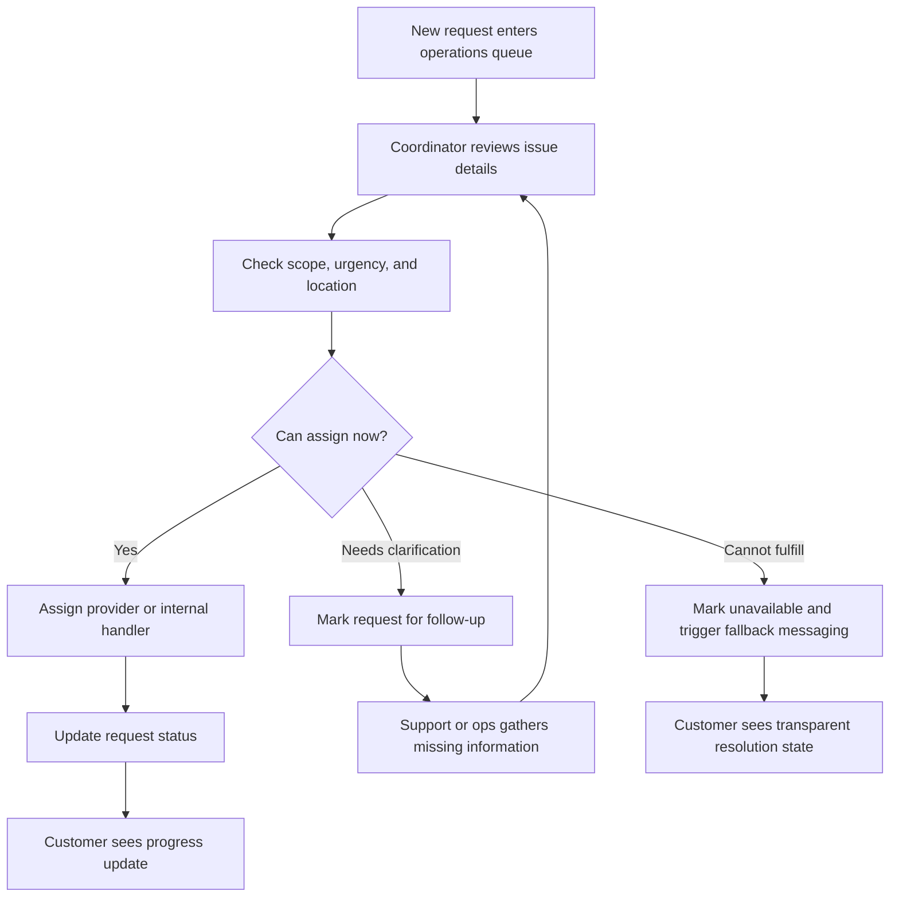

---
stepsCompleted:
  - 1
  - 2
  - 3
  - 4
  - 5
  - 6
  - 7
  - 8
  - 9
  - 10
  - 11
inputDocuments:
  - '/home/bogdansaipov/Projects/demos/demo1/_bmad-output/planning-artifacts/prd.md'
  - '/home/bogdansaipov/Projects/demos/demo1/_bmad-output/brainstorming/brainstorming-session-2026-04-07-142531.md'
workflowType: 'ux-design'
projectName: 'Handrix'
---

# UX Design Specification Handrix

**Author:** Bogdansaipov
**Date:** 2026-04-07 16:39:13 +05

---

## Initialization Context

This UX design workflow is initialized using the PRD and brainstorming session as primary inputs.

Additional stakeholder context provided during initialization:
- Product concept: rapid-response plumbing coordination service that reduces uncertainty in urgent repair situations.
- Core flow: issue selection, immediate containment guidance, expectation setting (price + ETA), one-tap confirmation, and dispatch tracking.
- Key UX goal: the user should feel "this is under control" within the first 2-3 minutes.
- Constraints: mobile-first, React SPA, minimal friction, and no account required.

## Executive Summary

### Project Vision

Handrix is a rapid-response plumbing coordination service designed to reduce uncertainty during urgent minor home repair situations. The product is intentionally focused on a narrow small-plumbing wedge for the MVP, allowing the experience to feel fast, credible, and emotionally reassuring rather than broad and marketplace-like.

From a UX perspective, Handrix should help the user feel that the situation is under control within the first 2-3 minutes. The experience must create confidence before technician arrival through a guided flow that combines issue selection, immediate containment guidance, expectation setting, one-tap confirmation, and visible dispatch tracking.

### Target Users

The primary users are renters and homeowners facing a live but manageable plumbing problem such as a leaking faucet, minor pipe leak, or toilet issue. They are likely to be stressed, distracted, and looking for fast clarity rather than deep comparison shopping. Most usage will happen on mobile devices in real-world, inconvenient contexts where one-handed interaction and low cognitive load matter.

Secondary users include internal operations coordinators and support staff. Operations users need a clear, efficient view of incoming requests, assignment needs, and status progression. Support users need fast visibility into request history, prior customer guidance, and current dispatch state so they can reinforce confidence instead of creating conflicting information.

### Key Design Challenges

The first design challenge is supporting stressed users who may be anxious, hurried, or unfamiliar with plumbing terminology. The interface must reduce decision fatigue, simplify language, and provide immediate orientation.

The second challenge is building trust without relying on a full marketplace model. Since the MVP is not winning through provider browsing, UX must communicate credibility through process clarity, expectation setting, and visible progress.

The third challenge is handling imperfect fulfillment paths gracefully. Delays, serviceability limits, or clarification needs must still feel transparent, useful, and confidence-preserving rather than vague or broken.

### Design Opportunities

Handrix has an opportunity to differentiate by delivering value before booking through immediate containment guidance that helps the user stabilize the situation. This can make the product feel useful within seconds, not just after confirmation.

The product also has an opportunity to use calm, human-centered status design to make dispatch tracking feel trustworthy and understandable. Clear state transitions, grounded language, and visible next steps can become a key part of the brand experience.

Finally, Handrix can stand out through a mobile-first confidence loop that feels focused, modern, and low-friction. If the flow consistently replaces panic with clarity, the UX itself becomes a competitive advantage.

## Core User Experience

### Defining Experience

The core Handrix experience is a guided confidence loop for urgent minor plumbing issues. The primary user action is not browsing providers or managing a full account, but moving quickly from problem recognition to a confirmed request with clear next steps. The experience should feel like rapid coordination during a stressful event, not like a marketplace or a long-form service request.

The most important interaction to get right is the end-to-end request flow from issue selection through confirmation. If the user can identify their problem, understand what to do immediately, see a believable price and response expectation, and confirm in one tap, the product delivers its core value.

### Platform Strategy

Handrix should be designed as a mobile-first React single-page application with touch-first interaction patterns and strong state continuity between steps. The interface should be optimized for modern mobile browsers, with desktop support preserved as a secondary layout rather than a separate experience.

Because the product is used in live repair situations, the platform should avoid account creation, unnecessary branching, and any interruption that breaks user momentum. The SPA should preserve progress reliably, support quick transitions between steps, and make polling-based dispatch tracking feel simple and calm rather than technical.

### Effortless Interactions

Issue selection should feel immediate and understandable even for users who do not know plumbing terminology. Guidance should appear at the right time without forcing extra effort, and expectation setting should be digestible in seconds rather than paragraphs.

Address entry, request review, and confirmation should feel lightweight and sequential. The user should never feel like they are filling out a complicated service form. The ideal interaction pattern is that each step answers one urgent question at the right moment: what is this, what should I do now, what happens next, and how do I lock in help.

Dispatch tracking should also feel effortless. Users should be able to glance at the screen and understand the current state, what progress has happened, and whether they need to do anything else.

### Critical Success Moments

The first critical success moment is when the user identifies their issue and immediately receives containment guidance that feels relevant and useful. This is where Handrix proves value before any booking is completed.

The second critical success moment is expectation setting. If price and ETA feel believable and clearly explained, the user is much more likely to trust the service and continue.

The third and most decisive moment is post-confirmation reassurance. Once the request is submitted, the user should feel that searching is over and the situation is actively moving forward. If this moment feels vague, delayed, or untrustworthy, the entire experience weakens.

### Experience Principles

Handrix should reduce uncertainty before it asks for commitment.

Handrix should feel calm, fast, and obvious on mobile.

Every step should answer the user's next urgent question without adding cognitive load.

Progress visibility should build trust as much as functionality does.

## Desired Emotional Response

### Primary Emotional Goals

The primary emotional goal of Handrix is to make the user feel calm, supported, and back in control during a stressful plumbing issue. The product should reduce panic quickly and replace uncertainty with a sense of clear forward motion.

A secondary emotional goal is trust. Users should feel that Handrix is credible, honest, and actively helping rather than simply collecting a request. The product should also create relief by making the next steps feel obvious and manageable.

### Emotional Journey Mapping

When users first arrive, they are likely to feel stress, urgency, and uncertainty. The interface should immediately signal that the product understands their situation and can help them act quickly.

During the core flow, the emotional shift should move from anxiety to clarity. Each step should reduce ambiguity, provide useful guidance, and increase the user's sense that the problem is becoming manageable.

After confirmation, the dominant emotional state should become reassurance. Users should feel that they no longer need to keep searching or second-guessing their decision because the situation is now being handled.

If something goes wrong, the product should preserve honesty and support. A delay or recovery path should still make the user feel informed and looked after rather than abandoned or misled.

On return usage, the product should feel dependable and familiar. The emotional memory should be that Handrix made a stressful situation easier, faster, and calmer.

### Micro-Emotions

The most important micro-emotions for Handrix are confidence over confusion, trust over skepticism, and reassurance over anxiety. These states are central to whether the experience feels valuable in an urgent moment.

A smaller but still important emotional target is relief. The product should create repeated small moments where the user feels they have one less thing to worry about.

The main emotions to avoid are doubt, overwhelm, ambiguity, and false urgency. If users feel rushed without understanding, or if the interface feels vague, trust will drop quickly.

### Design Implications

To create calm and control, the UX should use clear sequencing, plain language, and focused screens that present only the most relevant action at each step. Visual hierarchy should support fast scanning and quick comprehension under stress.

To create trust, the experience should show believable ETA and pricing language, explicit status changes, and transparent explanations when something is pending or delayed. The system should avoid overpromising or using vague reassurance that cannot be backed up operationally.

To create relief, the product should surface immediate containment guidance early, keep confirmation lightweight, and make dispatch tracking glanceable. The user should consistently feel that progress is visible and that they do not need to work harder for updates.

### Emotional Design Principles

Design for emotional de-escalation, not excitement.

Replace ambiguity with grounded clarity at every step.

Use transparency to build trust, especially when fulfillment is imperfect.

Make progress feel visible, credible, and calming.

## UX Pattern Analysis & Inspiration

### Inspiring Products Analysis

Uber is a strong reference for Handrix because it makes waiting feel active rather than uncertain. Its live status model, visible progress states, and credible updates help users trust that something is happening even when they are not taking action. For Handrix, this is especially relevant after confirmation, when the user needs reassurance that help is actually moving.

Airbnb is a useful reference for information design and emotional tone. Its interfaces often feel calm, structured, and reassuring even when users are making meaningful decisions. Clear summaries, good spacing, and confident hierarchy reduce cognitive load. For Handrix, this suggests a way to present issue details, pricing expectations, and booking summaries without making the experience feel dense or stressful.

Duolingo is a strong reference for low-friction progression. It consistently makes the next action obvious, keeps users moving forward with minimal hesitation, and avoids overloading the screen with competing choices. For Handrix, this pattern is highly transferable to the guided issue flow, where each step should feel simple, contained, and easy to complete under stress.

### Transferable UX Patterns

A key transferable pattern from Uber is progress visibility through clear state transitions. Handrix can adapt this into a customer-facing dispatch timeline that feels alive, trustworthy, and easy to scan at a glance.

A key pattern from Airbnb is calm hierarchy through strong layout discipline, concise summaries, and reassuring presentation. Handrix can use this to make price, ETA, issue summary, and next steps feel clear without becoming visually heavy.

A key pattern from Duolingo is obvious forward momentum. Handrix should make each step feel focused, lightweight, and immediately actionable, with a single primary next action and minimal branching.

Across all three products, an important shared pattern is confidence through clarity. None of them rely on users decoding complicated interfaces. They reduce hesitation by making the current state, next step, and likely outcome easy to understand.

### Anti-Patterns to Avoid

Handrix should avoid marketplace-style clutter such as dense provider cards, too many choices, or comparison-heavy screens. These patterns increase cognitive load and conflict with the urgent confidence loop.

The product should also avoid vague status messaging such as generic "processing" or "please wait" states without concrete meaning. In an urgent repair context, unclear waiting creates anxiety rather than trust.

Another anti-pattern to avoid is long, form-heavy intake that feels like administrative work. If the user feels they are filling out a service application instead of getting help, the experience will lose momentum quickly.

### Design Inspiration Strategy

What to adopt: visible progress states from Uber, calm summaries and hierarchy from Airbnb, and low-friction step progression from Duolingo. These patterns directly support Handrix's goal of making the user feel in control quickly.

What to adapt: Uber's live tracking should be simplified for a service-dispatch context rather than copied literally. Airbnb's calm presentation should be adapted to urgent-use scenarios with faster scanning and stronger action emphasis. Duolingo's progression model should be translated into a seriousness-appropriate tone without making the product feel playful.

What to avoid: overly broad navigation, crowded service-browsing interfaces, vague waiting states, and long multi-field forms. These patterns conflict with Handrix's emotional goal of calm clarity under pressure.

## Design System Foundation

### 1.1 Design System Choice

Handrix should use a themeable design system approach rather than a fully custom system or a rigid out-of-the-box visual framework. The recommended direction is to build on a proven accessible component foundation while creating a custom brand layer, interaction style, and design tokens tailored to the product's urgent, trust-focused use case.

This approach gives Handrix enough flexibility to feel distinct and emotionally appropriate while still moving quickly during MVP development.

### Rationale for Selection

A fully custom design system would provide maximum visual uniqueness, but it would likely add unnecessary design and engineering overhead for an MVP that needs to prove operational clarity and speed first. An established visual system with strong default branding would be faster initially, but it risks making the product feel generic or mismatched to the calm, confidence-building emotional tone that Handrix needs.

A themeable system offers the right balance. It supports rapid implementation with accessible, tested primitives while allowing Handrix to shape visual hierarchy, spacing, color usage, status treatments, and form patterns around its specific trust and urgency goals.

This is especially important because Handrix is not competing on broad feature depth. The product experience itself must feel focused, credible, and emotionally steady, which requires more customization than a default library theme alone would usually provide.

### Implementation Approach

The implementation should start with a strong component foundation for inputs, buttons, cards, alerts, sheets, progress indicators, and status elements. These primitives should then be composed into product-specific patterns for issue selection, containment guidance, expectation summaries, confirmation review, and dispatch tracking.

The system should define a small but disciplined token set for color, typography, spacing, border radius, elevation, and interaction states. Priority should be given to mobile responsiveness, accessible contrast, large touch targets, and fast-scanning layouts.

Custom patterns should be created only where they directly support the Handrix confidence loop. This keeps the system lean while ensuring the most important interactions feel purpose-built.

### Customization Strategy

Customization should focus on emotional clarity rather than decorative branding. The visual system should feel calm, direct, and reassuring, with clear status states, restrained color use, and strong content hierarchy.

Brand expression should come through tone, layout discipline, iconography, and state design more than through flashy visual styling. Handrix should look modern and credible, but the interface should never distract from the user's urgent goal.

The system should especially customize the following areas: issue-selection cards, guidance panels, expectation summaries, confirmation modules, and dispatch-progress components. These are the moments where product trust is either built or lost, so they should feel intentionally designed rather than assembled from generic defaults.

## 2. Core User Experience

### 2.1 Defining Experience

The defining Handrix experience is guided emergency-style service coordination for a minor plumbing issue. The core interaction is that a stressed user can move from "something is wrong" to "help is on the way and I know what to do right now" in a few focused steps, without browsing, comparing, or creating an account.

If Handrix gets one thing perfectly right, it should be this: turning an uncertain repair moment into a clear, guided, confidence-building request flow. That is the interaction users are most likely to describe to others, and it is the moment where the product proves it is meaningfully better than search, directories, or generic service marketplaces.

### 2.2 User Mental Model

Users do not think of their problem as "booking a home service marketplace task." Their mental model is closer to "I need to stop this from getting worse and get someone trustworthy here fast." They want fast orientation, simple guidance, and confidence that they are taking the right action.

Today, users often solve this problem by searching online, calling a landlord, messaging a building contact, or trying local service providers one by one. What they dislike about current solutions is uncertainty: unclear seriousness, unclear pricing, unclear response times, and unclear trustworthiness. They are likely to get frustrated by jargon, excessive form filling, or any screen that feels like shopping instead of getting help.

### 2.3 Success Criteria

The core experience succeeds when users feel immediate clarity after the first interaction, understand their issue well enough to keep moving, and reach confirmation without hesitation or confusion.

Users should feel that the flow is fast, obvious, and relevant to their situation. They should receive useful feedback at each step, especially when guidance appears, when expectations are shown, and when confirmation is complete.

The strongest indicators of success are:
- The user can identify an issue type quickly without second-guessing.
- The user understands what action to take now and what will happen next.
- The user feels reassured enough after confirmation that they stop searching elsewhere.

### 2.4 Novel UX Patterns

Handrix should primarily rely on established UX patterns that users already understand, especially for mobile step flows, cards, summaries, confirmations, and status timelines. This is not a product that benefits from novel interaction mechanics for their own sake.

Its differentiation should come from how familiar patterns are combined into a trust-building confidence loop. The unique twist is not a new gesture or control, but the sequencing of reassurance: identify the issue, stabilize the situation, set expectations, confirm quickly, and show credible progress.

Because the pattern is emotionally specialized rather than mechanically novel, Handrix should prioritize clarity over invention. Any innovation should happen in the choreography of guidance and trust, not in interaction complexity.

### 2.5 Experience Mechanics

Initiation begins with an immediate, focused entry point that asks the user what is happening in plain language. The starting screen should invite fast issue recognition and reassure the user that this experience is designed for urgent plumbing help.

Interaction proceeds through a tightly structured flow. The user selects an issue, answers a small number of clarifying questions, receives containment guidance, reviews price and ETA expectations, and confirms the request. Each screen should have one dominant action, minimal competing choices, and visible progress through the flow.

Feedback should be immediate and confidence-building. When the user selects an issue, the system should respond with relevant follow-up. When guidance is shown, it should feel specific and actionable. When expectations are presented, they should feel transparent and believable. If the user makes a mistake or the issue is out of scope, the system should recover with calm, direct guidance rather than generic errors.

Completion happens when the request is confirmed and the interface shifts from intake mode to reassurance mode. At that point, the user should clearly understand that the request has been received, what stage it is in, and whether they need to do anything else. The next step should feel like waiting with confidence, not waiting in uncertainty.

## Visual Design Foundation

### Color System

Handrix should use a calm, trust-building color system centered on clear contrast, restrained saturation, and semantic consistency. The palette should avoid overly bright, playful, or decorative colors in favor of tones that feel stable, modern, and reassuring.

The primary brand color should be a deep slate-blue or blue-teal family that communicates reliability and focus without feeling cold or corporate. Supporting neutrals should be warm off-whites, soft grays, and charcoal text tones to keep the interface clean and readable. Accent color use should be limited and functional rather than expressive.

Suggested semantic color approach:
- Primary: deep slate-blue for primary actions and key progress states
- Secondary: muted blue-gray for supporting UI surfaces and secondary actions
- Success: softened green for confirmed progress or resolved states
- Warning: amber-gold for caution or delayed attention states
- Error: muted red for blocked, unavailable, or failed states
- Neutral surfaces: off-white, cloud gray, and charcoal for strong readability and calm balance

Status color should always be paired with text labels and icons so meaning is never dependent on color alone. The system should maintain strong contrast and avoid overly aggressive red/yellow usage that could increase stress unnecessarily.

### Typography System

The typography should feel modern, highly readable, and emotionally steady. A clean sans-serif typeface with strong screen legibility should be used throughout the product. The tone should feel competent and approachable rather than geometric, playful, or overly branded.

The type hierarchy should support fast scanning on mobile:
- Large, clear headings for orientation and state transitions
- Medium-weight section titles for summaries and grouped content
- Readable body text for guidance and reassurance
- Small supporting text only where necessary, never for critical instructions

Typography should be optimized for short-form guidance, status updates, and summary modules rather than long reading sessions. Line lengths should stay compact on mobile, and line height should be generous enough to preserve clarity during stressful use.

### Spacing & Layout Foundation

The layout should feel open enough to reduce pressure, but not so sparse that users lose momentum. Handrix should use a disciplined spacing system based on an 8px scale, with strong vertical rhythm and clear separation between decision points.

The interface should prioritize:
- One primary action per screen
- Clear grouping of related information
- Generous touch targets
- Short visual scans from top to action
- Strong alignment and predictable spacing between modules

Cards, guidance panels, summaries, and progress modules should have enough breathing room to feel trustworthy and understandable, but should remain compact enough for quick mobile progression. The layout should feel structured and calm, with limited simultaneous choices on screen.

A single-column mobile-first grid should define the primary experience. Desktop layouts can widen content areas and introduce supporting side spacing, but should preserve the same clear linear flow.

### Accessibility Considerations

Accessibility should be treated as part of the emotional design strategy, not a separate compliance layer. Users may be stressed, distracted, or physically uncomfortable while using Handrix, so readability and interaction clarity are essential.

The visual system should ensure:
- WCAG 2.1 AA contrast compliance for all core text and actions
- Large touch targets for all interactive controls
- Clear focus states for keyboard and assistive navigation
- Text labels paired with icons and color states
- Readable font sizes with strong contrast on mobile
- Avoidance of overly thin type, low-contrast placeholders, or visually ambiguous controls

The overall visual foundation should reduce interpretation effort. Users should never have to guess what is important, what is actionable, or what state their request is currently in.

## Design Direction Decision

### Design Directions Explored

Four visual directions were explored for Handrix. Calm Clinical emphasized gentle de-escalation through soft surfaces and low-stress presentation. Warm Utility emphasized human reassurance, practical clarity, and approachable service tone. Precision Dispatch emphasized stronger status hierarchy and operational trust through visible progress states. Quiet Premium emphasized refined minimalism and modern credibility with restrained visual styling.

All four directions were aligned to the same product foundation: calm tone, clarity under stress, mobile-first usability, and trust-building interactions. The main differences were in warmth, density, and how strongly the interface emphasized dispatch-state visibility.

### Chosen Direction

The chosen direction is a hybrid approach that uses Warm Utility as the base visual language and incorporates selected status-display patterns from Precision Dispatch.

Warm Utility provides the strongest match for the pre-confirmation experience because it feels helpful, grounded, and reassuring without becoming soft or decorative. It supports the product goal of making users feel that the situation is under control.

Precision Dispatch contributes the stronger post-confirmation interaction model. Its more explicit progress treatment is especially effective for the dispatch-tracking phase, where users need visible, credible forward motion rather than passive waiting.

### Design Rationale

This hybrid direction works because Handrix has two distinct emotional jobs. Before confirmation, it must calm and guide. After confirmation, it must reassure and prove active progress. A single-direction approach risks over-optimizing for only one of those moments.

Warm Utility is the better fit for issue selection, containment guidance, expectation setting, and confirmation because it feels human and service-oriented. Precision Dispatch strengthens the tracking experience by making state changes, assignment progress, and next steps more explicit.

Together, they create a design system that feels supportive during intake and trustworthy during dispatch. This aligns closely with Handrix's confidence loop and the emotional goal of replacing uncertainty with calm control.

### Implementation Approach

The implementation should use Warm Utility as the primary visual foundation across onboarding, issue intake, guidance, summaries, and confirmation. This means warmer neutrals, practical copy presentation, and a more reassuring hierarchy in the core flow.

After confirmation, the interface should shift slightly toward the Precision Dispatch model. Status cards, progress timelines, and request-state modules should become more structured and explicit, with stronger hierarchy and clearer service progression.

This transition should feel cohesive rather than abrupt. The same typography, token system, and component foundation should remain in place, while the emphasis changes from reassurance-through-guidance to reassurance-through-visible-progress.

## User Journey Flows

### Customer Journey: Guided Request to Confirmed Dispatch

This flow covers the primary Handrix value loop for a customer with a minor plumbing issue. The goal is to move from uncertainty to confirmed progress quickly, with guidance and expectations surfaced at the right moments.

This journey should minimize hesitation by keeping each step focused and sequential. The user should always know what the next action is and why the information is being requested.

### Customer Journey: Recovery Path for Delays or Unserviceable Requests

This flow handles the moments where Handrix cannot immediately fulfill the ideal path. The goal is to preserve trust through transparency, fallback guidance, and clear next steps.

This journey is critical because a failed or delayed fulfillment moment can still be a successful UX moment if the system remains honest, calm, and useful.

### Operations Journey: Intake to Assignment

This flow covers the internal coordinator experience needed to make the customer-facing promise believable. The goal is to support fast assignment, aligned status updates, and low operational confusion.

This journey should mirror the customer-visible state model closely so internal operations and customer messaging never drift apart.

### Journey Patterns

Across these flows, Handrix should standardize a few recurring journey patterns:
- Progressive disclosure: only show the next needed question or action
- Visible progress: each stage should make forward motion explicit
- Recovery with explanation: delays and failures should always include a reason and next step
- State alignment: internal and customer-facing statuses should map clearly to one another

### Flow Optimization Principles

The core optimization principle is speed to confidence, not just speed to submission. Every flow should reduce uncertainty as early as possible.

The second principle is one decision at a time. Users should not face dense branching or multi-part choices on a single screen.

The third principle is trust-preserving recovery. If the happy path breaks, the product should still feel competent, transparent, and supportive.

## Component Strategy

### Design System Components

The themeable design system foundation should provide the majority of Handrix's baseline interface elements. These should include buttons, text inputs, text areas, radio groups, checkboxes, cards, alerts, drawers or sheets, progress indicators, badges, dividers, and modal or dialog primitives.

These foundation components are well suited to the Handrix MVP because they cover the majority of standard interaction needs across issue intake, clarifying questions, address entry, confirmation, and support messaging. They should be themed to match the Warm Utility plus Precision Dispatch visual direction, but should remain structurally consistent with the chosen component foundation.

The main gaps are not basic controls, but product-specific orchestration components that support trust, guidance, and visible progress.

### Custom Components

### Issue Selection Card

**Purpose:** Help users identify their plumbing problem quickly without needing technical vocabulary.  
**Usage:** Used at the start of the customer request flow.  
**Anatomy:** Issue label, short description, optional icon, urgency cue, selected state.  
**States:** Default, hover, selected, disabled.  
**Variants:** Standard issue card, high-urgency variant.  
**Accessibility:** Fully keyboard selectable, clear focus ring, descriptive label text.  
**Content Guidelines:** Use plain-language issue names and short clarifying copy.  
**Interaction Behavior:** Single-tap selection advances the user toward the next step or reveals clarifying questions.

### Containment Guidance Panel

**Purpose:** Deliver immediate stabilization instructions before request confirmation.  
**Usage:** Appears after issue classification and during recovery flows.  
**Anatomy:** Guidance title, short steps, optional caution note, secondary reassurance copy.  
**States:** Informational, warning, recovery/fallback.  
**Variants:** Inline panel, full-width emphasis panel.  
**Accessibility:** Structured headings, readable list formatting, icon and text pairing.  
**Content Guidelines:** Keep instructions brief, specific, and calm.  
**Interaction Behavior:** May remain visible while the user continues, or collapse into a summary after acknowledgement.

### Expectation Summary Module

**Purpose:** Show ETA, pricing expectation, and what happens next in one high-trust summary.  
**Usage:** Used before confirmation and in revised expectation states.  
**Anatomy:** ETA row, pricing row, short explanation, primary confirmation action.  
**States:** Standard, revised expectation, delayed.  
**Variants:** Pre-confirmation summary, recovery summary.  
**Accessibility:** Strong heading hierarchy, high contrast, clear labels for all values.  
**Content Guidelines:** Use believable ranges and transparent qualifiers instead of overconfident promises.  
**Interaction Behavior:** Users review, optionally edit prior information, or proceed to confirm.

### Request Status Timeline

**Purpose:** Make dispatch progress feel visible and trustworthy after confirmation.  
**Usage:** Customer tracking screen and support context surfaces.  
**Anatomy:** Timeline steps, current state highlight, supporting timestamps or notes, next-step message.  
**States:** Submitted, in review, assigned, on the way, delayed, completed, unavailable.  
**Variants:** Compact summary version, full tracking version.  
**Accessibility:** Text labels for every state, semantic structure for screen readers, no color-only meaning.  
**Content Guidelines:** Use grounded language that reflects real operational states.  
**Interaction Behavior:** Updates automatically on refresh and clearly signals when the state changes.

### Request Recovery State Card

**Purpose:** Handle serviceability issues, delays, and blocked states without breaking trust.  
**Usage:** Appears when clarification, fallback guidance, or revised expectations are needed.  
**Anatomy:** Problem statement, explanation, next-best action, optional support path.  
**States:** Clarification needed, delayed, unavailable, resolved.  
**Variants:** Inline flow version, full-page interruption version.  
**Accessibility:** Clear heading, concise explanation, strong action affordance.  
**Content Guidelines:** Explain what changed, why it changed, and what the user can do next.  
**Interaction Behavior:** Allows the user to continue, correct details, or exit with guidance.

### Operations Request Queue Item

**Purpose:** Help internal coordinators scan, prioritize, and act on requests quickly.  
**Usage:** Operations dashboard queue and request list surfaces.  
**Anatomy:** Issue type, urgency cue, address summary, current state, time received, assignment status.  
**States:** New, needs clarification, assignable, assigned, blocked, unavailable.  
**Variants:** Compact row, expanded detail card.  
**Accessibility:** Readable density, strong contrast, keyboard focus for dashboard usage.  
**Content Guidelines:** Surface only the information needed for triage first.  
**Interaction Behavior:** Opens into full request detail and supports quick status change actions.

### Component Implementation Strategy

Handrix should maximize reuse of foundation components for all standard interaction patterns and reserve custom work for moments that directly affect trust, comprehension, and progression. The custom components should be built from design-system tokens and primitive building blocks so they remain visually and behaviorally consistent.

The highest-priority custom components are the Issue Selection Card, Containment Guidance Panel, Expectation Summary Module, and Request Status Timeline because they define the confidence loop. Recovery and operations components should follow next, since they preserve trust when the happy path breaks and keep internal coordination aligned with the customer experience.

All components should follow the same accessibility rules, spacing logic, status semantics, and tone guidelines so the product feels cohesive across both customer and internal interfaces.

### Implementation Roadmap

**Phase 1 - Core Confidence Loop**
- Issue Selection Card
- Containment Guidance Panel
- Expectation Summary Module
- Request Status Timeline

**Phase 2 - Recovery and Trust Preservation**
- Request Recovery State Card
- Clarification prompt patterns
- Delayed-status messaging variants

**Phase 3 - Internal Operations Support**
- Operations Request Queue Item
- Expanded request detail modules
- Shared customer/support status views
